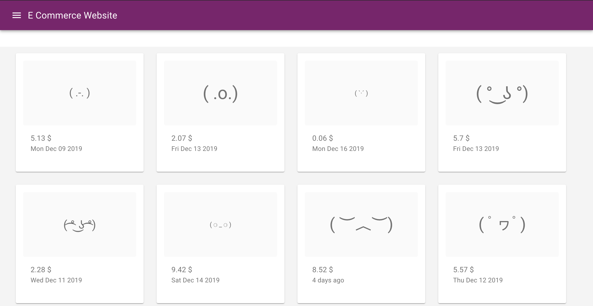
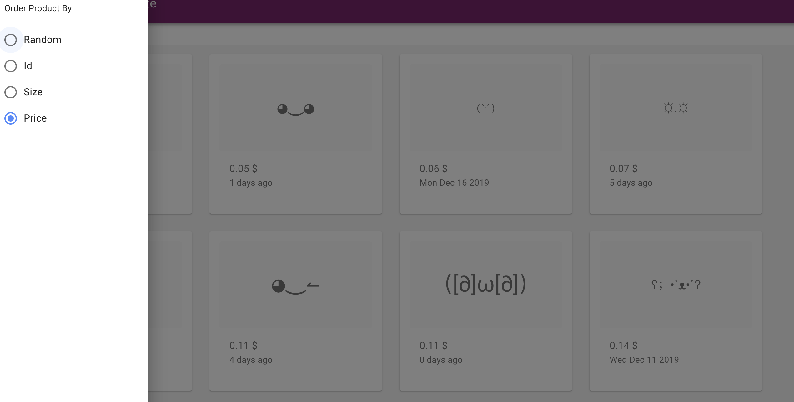
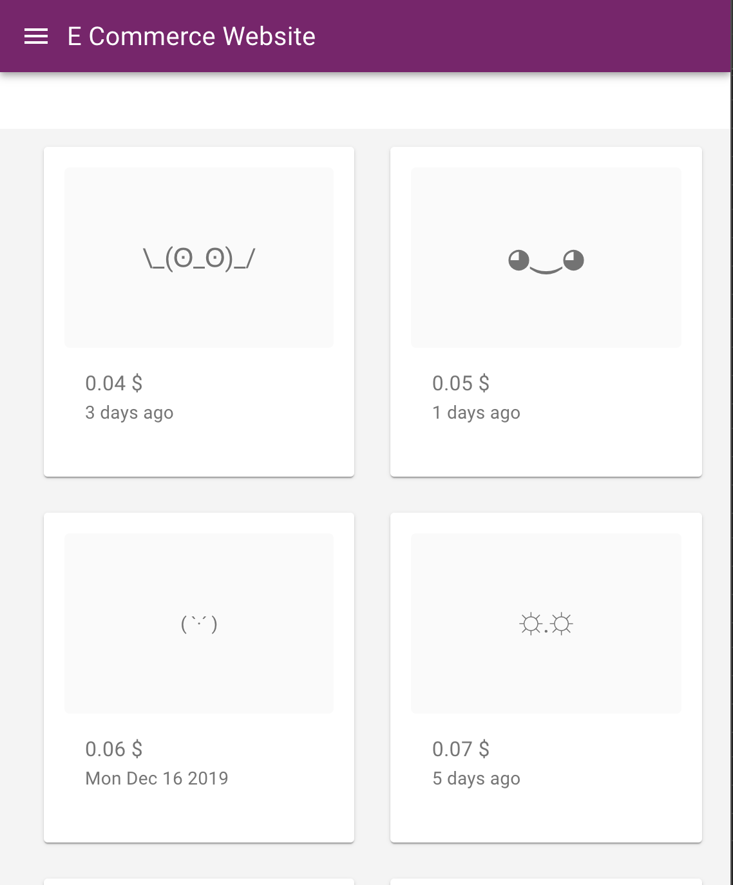
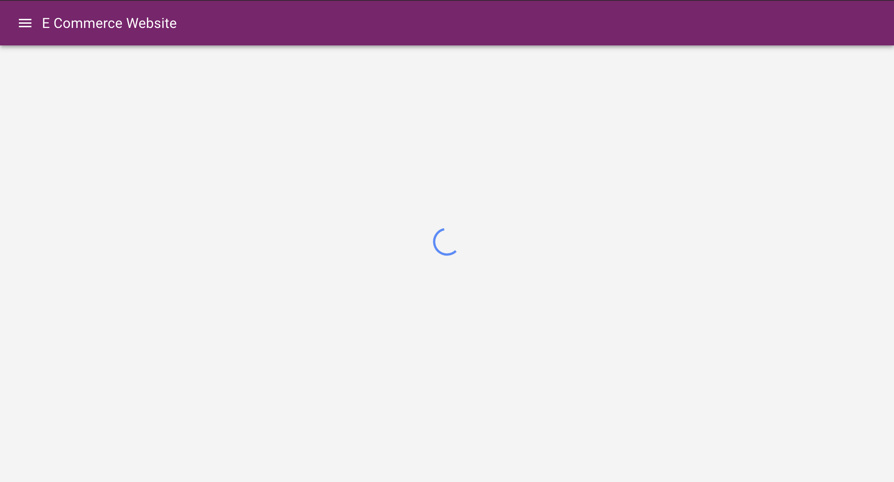

# E-Commerce Font

> A ReactJs  Application which is an E-Commerce website for Font with different sizes

> tags: #ReactJs #Material-UI #Redux 
>
 Grid of Product         |  Different Sort Functions
:-------------------------:|:-------------------------:
  | 

Responsive Website         |  Loading..
:-------------------------:|:-------------------------:
   |

> Features

- Sort the List by Size/id/Price
- A Responsive Design 
- Change Language 
- Automatically load more items as you scroll down
- Prepare data before,..
- Ads Feature to show some Ads
- Redux Architecture

> Structure 

- /src
    - assets:  containts all the assets (Image, Icons...)
    - Components: our Component which will be used again
    - config : we put our configuration on the folder "API function"
    - routing: for different Routes
    - utils: some functions that can be used again
    - theme: our Theme variable
    - views: our Views
    - Redux : 
    
            - action: action folder 
            - reducer: reducer folder
            - logics: our funtions that calls the actions
            - actionTypes: different Action types
            - initialState: our initial state
            - rootReducer: our Root Reducer 
            - configureStore: our Store

    

## Installation

- yarn install
- yarn start

## Support

Reach out to me at one of the following places!

-  fm_chohra@esi.dz

---

## License

- **[MIT license](http://opensource.org/licenses/mit-license.php)**
- Copyright 2019 © 

